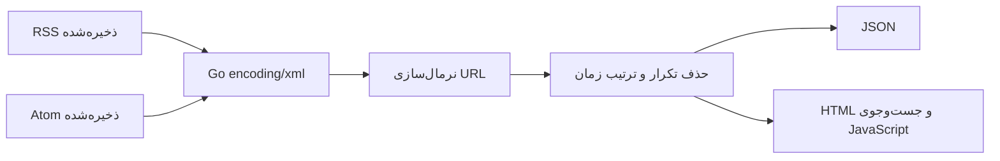

<p align="center"></p>

<h1 align="center">FeedFold</h1>
<p align="center"><strong>ادغام RSS و Atom ذخیره‌شده در صفحهٔ قابل‌جست‌وجوی آفلاین</strong></p>

<p align="center">
  <a href="https://github.com/al1re3a/feedfold/actions/workflows/ci.yml"></a>
  <a href="LICENSE"></a>
  
  <a href="https://github.com/al1re3a/feedfold/releases"></a>
</p>

<p align="center">
  <a href="#quick-start"></a>
  <a href="docs/USAGE.md"></a>
  <a href="https://github.com/al1re3a/feedfold/issues"></a>
</p>

چند RSS/Atom ذخیره‌شده را به یک فهرست HTML قابل‌جست‌وجو تبدیل می‌کند؛ بدون سرور، حساب و واکشی شبکه.

<details>
<summary>✨ نشان متحرک پروژه</summary>


</details>

---

<a id="contents"></a>
## 🧭 فهرست

[قابلیت‌ها](#features) · [شروع سریع](#quick-start) · [فناوری‌ها](#stack) · [معماری](#architecture) · [تست](#tests) · [محدودیت‌ها](#limitations) · [مشارکت](#contributing)

<a id="features"></a>
## ✨ چه کاری انجام می‌دهد؟

- ✅ خواندن RSS 2.0 و Atom از فایل محلی
- ✅ حذف fragment و پارامترهای utm_ برای تطبیق URL
- ✅ انتخاب نسخهٔ جدیدتر آیتم تکراری و مرتب‌سازی زمانی پایدار
- ✅ HTML مستقل با جست‌وجو و خروجی JSON؛ محتوای feed به‌صورت متن escape می‌شود

| مشخصه | مقدار |
|---|---|
| مخاطب | نویسندهٔ خبرنامه و خوانندهٔ فنی آفلاین |
| فناوری و پیش‌نیاز | Go 1.23+ · Node 22 برای تست رابط |
| نسخه | 0.1.0 |
| مجوز | MIT |
| مدل اجرا | ابزار محلی؛ بدون حساب سرویس خارجی |

<a id="quick-start"></a>
## ⚡ نصب و شروع سریع

```bash
git clone https://github.com/al1re3a/feedfold.git
cd feedfold
```

پیش‌نیازهای جدول بالا را نصب کنید؛ به دسترسی مدیر برای اجرای نمونه نیاز نیست.

```bash
go build -o feedfold .
./feedfold --format html examples/rss.xml examples/atom.xml > report.html
./feedfold --format json examples/rss.xml examples/atom.xml
```

گزارش نمونه ۳ مقالهٔ یکتا از ۴ ورودی دارد. `report.html` را باز و عنوان یا نام منبع را جست‌وجو کنید. در Windows می‌توانید `go build -o feedfold.exe .` و سپس `./feedfold.exe` اجرا کنید. لینک‌های example.com فقط دادهٔ نمایشی هستند.

> [!NOTE]
> گزارش هیچ درخواست خودکاری به شبکه ندارد؛ کلیک روی عنوان، سایت اصلی مقاله را باز می‌کند.

برای توقف فرمان یا سرور توسعه، در ترمینال <kbd>Ctrl</kbd> + <kbd>C</kbd> را فشار دهید.

<a id="stack"></a>
## 🧰 فناوری‌ها

<picture>
  <source media="(prefers-color-scheme: dark)" srcset="https://skillicons.dev/icons?i=go,js,html,css&amp;theme=dark">
  <source media="(prefers-color-scheme: light)" srcset="https://skillicons.dev/icons?i=go,js,html,css&amp;theme=light">
  
</picture>

Go · JavaScript · HTML · CSS

<a id="architecture"></a>
## 🏗 معماری



<details>
<summary>📁 ساختار فایل‌ها</summary>

```text
feedfold/
  main.go
  main_test.go
  go.mod
  web/
  examples/rss.xml
  examples/atom.xml
  tests/report.test.cjs
  assets/readme-banner.png
  docs/USAGE.md
  .github/workflows/ci.yml
```

</details>

<a id="tests"></a>
## 🧪 تست و وضعیت بررسی

```bash
go test ./...
go vet ./...
node --test tests/report.test.cjs
```

در اعتبارسنجی محلی Windows در ۲۰۲۶-۰۹-۰۵، **14 تست یا assertion اصلی** پاس شد. جزئیات محیط و موارد بررسی‌نشده در [VALIDATION.md](VALIDATION.md) آمده است. Badge بالای صفحه نتیجهٔ واقعی GitHub Actions را نشان می‌دهد؛ سبز بودن آن را از اجرای محلی استنتاج نمی‌کنیم.

<a id="limitations"></a>
## ⚠️ محدودیت‌ها

فایل‌ها باید از قبل ذخیره شده باشند؛ دانلود feed، OPML، وضعیت خوانده‌شده و کش تصویر وجود ندارد. لینک نسبی، لینک دارای credentials و scheme غیر HTTP(S) کنار گذاشته می‌شود و شمارش آن در stderr می‌آید. هر فایل حداکثر ۵ MiB و کل ورودی حداکثر ۱۰هزار آیتم. تاریخ ناشناخته به انتهای فهرست می‌رود؛ URLهای برابر با UTM متفاوت یکسان فرض می‌شوند. پشتیبانی کامل همهٔ افزونه‌های RSS/Atom ادعا نمی‌شود.

### نسبت به ابزارهای مشابه

مرجع مرتبط: [Newsbeuter](https://github.com/akrennmair/newsbeuter). انتخاب این دامنه بر اساس بررسی مستندات ابزارهای مشابه است؛ ادعای برتری کلی، سرعت بیشتر یا تضمین جذب استار نداریم. مزیت این نسخه: چند RSS/Atom ذخیره‌شده را به یک فهرست HTML قابل‌جست‌وجو تبدیل می‌کند؛ بدون سرور، حساب و واکشی شبکه.

### 🗺 وضعیت توسعه

| قابلیت | وضعیت |
|---|---|
| قابلیت‌های فهرست‌شده و مثال‌ها | ✅ پیاده‌سازی‌شده |
| تست‌های اصلی محلی | ✅ پاس‌شده |
| ورودی OPML و لینک نسبی با base URL صریح | ⏳ پیشنهاد آینده؛ پیاده‌سازی نشده |

---

<a id="contributing"></a>
## 🤝 مشارکت و بازخورد

📚 [راهنمای استفاده](docs/USAGE.md) · 🔐 [گزارش امنیتی](SECURITY.md) · 🤝 [راهنمای مشارکت](CONTRIBUTING.md) · 📣 [برنامهٔ معرفی](LAUNCH.md)

اگر پروژه مسئله‌ای از کار شما حل کرد، یک نمونهٔ بدون دادهٔ خصوصی در issue توضیح دهید. استار برای پیدا کردن دوبارهٔ پروژه و دنبال‌کردن [سازنده](https://github.com/al1re3a) برای دیدن ابزارهای بعدی اختیاری است.

<a href="https://github.com/al1re3a/feedfold/graphs/contributors"></a>

بنر با ImageGen تولید شده و تصویر مفهومی است، نه اسکرین‌شات برنامه. [منشأ تصویر](assets/IMAGE.md). تصاویر badge، آیکون و انیمیشن README از سرویس‌های ثالث بارگذاری می‌شوند؛ خود بنر داخل ریپازیتوری است. تاریخ کامیت‌ها واقعی است و تاریخچهٔ بازسازی‌شده نداریم.
